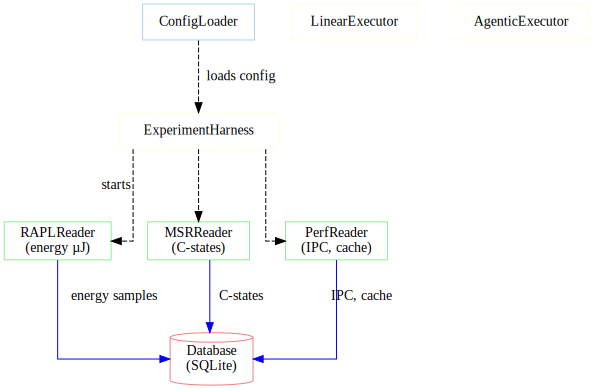

# System Architecture

This document describes the high-level architecture of A-LEMS, showing the four main layers and how they interact.

---

## 🏗️ Architecture Overview

A-LEMS is built as a **4-layer system** with clear separation of concerns:

1. **Configuration Layer** - Centralized configuration management
2. **Hardware Layer** - Physical sensor reading and measurement
3. **Execution Layer** - AI workflow orchestration
4. **Database Layer** - Persistent storage and data lineage

---

## 🧩 Layer 1: Configuration Layer

**Purpose:** Centralized configuration management for all modules.

| Component | Responsibility |
|-----------|----------------|
| `ConfigLoader` | Loads YAML/JSON configs from `config/` directory |

**Key Config Files:**
- `app_settings.yaml` - Main app settings (DB, sampling, experiment)
- `tasks.yaml` - Predefined experiment tasks with levels (1-3)
- `models.json` - LLM model configurations
- `hw_config.json` - Auto-detected hardware configuration

---

## 🔧 Layer 2: Hardware Layer

**Purpose:** Hardware-level data collection with high-frequency sampling.

### Readers

| Reader | Metrics | Frequency |
|--------|---------|-----------|
| `RAPLReader` | package, core, uncore, dram energy (µJ) | 100Hz |
| `MSRReader` | C-state counters, ring bus freq | Snapshots |
| `PerfReader` | instructions, cycles, cache misses | Process-attached |
| `TurbostatReader` | CPU freq, C-state %, package temp | 10Hz |
| `SensorReader` | Thermal zone temperatures | 1Hz |
| `SchedulerMonitor` | Context switches, interrupts | 10Hz |

### Core Orchestrator

| Component | Responsibility |
|-----------|----------------|
| `EnergyEngine` | Coordinates all readers with perfect synchronization |

**Key Features:**
- Dedicated sampling thread (configurable, default 100Hz)
- Core pinning for measurement consistency
- Context manager interface (`with EnergyEngine():`)

---

## 🤖 Layer 3: Execution Layer

**Purpose:** Run linear and agentic workflows with perfect measurement alignment.

### Executors

| Executor | Description |
|----------|-------------|
| `LinearExecutor` | Single-pass LLM execution without tools |
| `AgenticExecutor` | Multi-step reasoning with tools (plan → execute → synthesize) |

### Core Controllers

| Component | Responsibility |
|-----------|----------------|
| `ExperimentHarness` | Main experiment controller (2000+ lines) |
| `ExperimentRunner` | Shared logic for test scripts |

### Phase Timing

Agentic workflows track three distinct phases:

1. **Planning Phase** - LLM creates execution plan
2. **Execution Phase** - Tools run based on the plan
3. **Synthesis Phase** - Results combined into final answer

Each phase emits orchestration events for tax calculation.

---

## 💾 Layer 4: Database Layer

**Purpose:** Persistent storage with complete data lineage.

### Architecture (Adapter + Repository Pattern)

The database layer follows two classic design patterns:

#### Adapter Pattern

| Component | Status | Description |
|-----------|--------|-------------|
| `DatabaseInterface` | ✅ Active | Abstract base class defining database operations |
| `SQLiteAdapter` | ✅ Working | SQLite implementation for local development and single-user deployments |
| `PostgreSQLAdapter` | ⏳ Planned | PostgreSQL implementation for multi-user, distributed deployments |

#### Repository Pattern

| Repository | Purpose |
|------------|---------|
| `RunsRepository` | 80+ column run insertion and querying |
| `SamplesRepository` | High-frequency energy, CPU, and interrupt samples |
| `EventsRepository` | Orchestration events for tax calculation |
| `TaxRepository` | Tax summary computation and storage |
| `ThermalRepository` | Thermal sample management |

text

### Repository Pattern

| Repository | Purpose |
|------------|---------|
| `RunsRepository` | 80+ column run insertion |
| `SamplesRepository` | High-frequency samples (energy, CPU, interrupt) |
| `EventsRepository` | Orchestration events |
| `TaxRepository` | Tax summary computation |
| `ThermalRepository` | Thermal samples |

### Schema (10+ Tables)

| Table | Purpose |
|-------|---------|
| `experiments` | Experiment metadata |
| `hardware_config` | Hardware fingerprints |
| `environment_config` | Software environment |
| `runs` | Core run data (80+ columns) |
| `energy_samples` | 100Hz RAPL samples |
| `cpu_samples` | 10Hz CPU telemetry |
| `interrupt_samples` | 10Hz interrupt data |
| `thermal_samples` | 1Hz temperature samples |
| `orchestration_events` | Agent step tracking |
| `orchestration_tax_summary` | Per-pair tax calculations |
| `schema_version` | Migration tracking |

## 🔄 Data Flow

The data flows through the system in a linear pipeline:

1. **Hardware Layer** (`/sys`, `/proc`, MSR registers)
   - Raw energy counters, performance events, system metrics

2. **Readers Layer** (`rapl_reader.py`, `msr_reader.py`, etc.)
   - Hardware-specific readers extract raw measurements

3. **EnergyEngine**
   - `start_measurement()` - Begin sampling
   - `_sampling_loop()` - 100Hz data collection
   - `stop_measurement()` - Finalize measurement

4. **RawEnergyMeasurement** (Layer 1)
   - Immutable raw data stored for reproducibility

5. **ExperimentHarness**
   - `run_linear()` or `run_agentic()` executes AI workload

6. **EnergyAnalyzer**
   - `compute(raw, baseline)` → DerivedEnergyMeasurement (Layer 3)
   - Calculates workload energy, reasoning energy, orchestration tax

7. **SustainabilityCalculator**
   - `calculate_from_derived()` → Carbon, water, methane metrics

8. **Result Assembly**
   - `ml_features` dictionary with 80+ features
   - High-frequency samples (energy, CPU, interrupt)

9. **Database Insertion**
   - `test_harness.py` / `run_experiment.py` call `save_pair()`
   - `DatabaseManager` via repositories stores all data

10. **Persistence**
    - SQLite database at `data/experiments.db`
    - 10+ tables with complete data lineage

## 🎯 Key Design Patterns

| Pattern | Implementation | Purpose |
|---------|----------------|---------|
| **3-Layer Architecture** | Raw → Baseline → Derived | Scientific rigor, never modify raw data |
| **Adapter Pattern** | `DatabaseInterface` → `SQLiteAdapter` | Support multiple databases |
| **Repository Pattern** | `RunsRepository`, `TaxRepository` | Separate data access from business logic |
| **Context Manager** | `with EnergyEngine():` | Guaranteed start/stop of measurement |
| **Function-based Modularity** | Small focused functions | Testability, maintainability |

---

## 📊 Module Interactions

| Module | Responsibility | Key Classes | Interacts With |
|--------|----------------|-------------|----------------|
| **Module 0** | Configuration | `ConfigLoader` | All modules |
| **Module 1** | Hardware Measurement | `EnergyEngine`, all Readers | Module 3 (provides raw data) |
| **Module 2** | Sustainability | `SustainabilityCalculator` | Module 3 (consumes derived data) |
| **Module 3** | AI Execution | `ExperimentHarness`, Executors | Modules 1,2,4 |
| **Module 4** | Storage | `DatabaseManager`, Repositories | Module 3 (stores results) |

---

## 🔧 Extension Points

### Adding a New Hardware Reader

1. Create new reader class in `core/readers/`
2. Implement `read()` method returning metrics
3. Add to `EnergyEngine.__init__`
4. Update configuration if needed

### Adding a New Task

1. Add task definition to `config/tasks.yaml`
2. Specify level (1-3) and tools
3. Task automatically available in GUI and CLI

## ✅ Architecture Principles

1. **Separation of Concerns** - Each layer has a single responsibility
2. **Immutable Raw Data** - Never modify original measurements
3. **Configuration over Code** - Behavior controlled by config files
4. **Research Reproducibility** - Complete data lineage
5. **Extensibility** - Easy to add new readers, tasks, and tools

---
