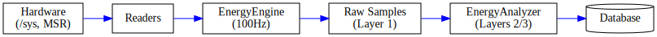

# Data Flow

This document describes how energy data moves through the A-LEMS system, from hardware sensors to the database.

---

## 🔄 Data Flow Overview

A-LEMS captures energy data at 100Hz and processes it through a 5-stage pipeline:

#### Detailed Flow:

| Step | Component | Function |
|------|-----------|----------|
| **1** | Hardware | RAPL counters, MSR registers, perf events |
| **2** | Readers | `RAPLReader`, `MSRReader`, `PerfReader`, etc. |
| **3** | `EnergyEngine` | 100Hz sampling, synchronization |
| **4** | Samples | Raw energy samples with timestamps |
| **5** | Database | Persistent storage in SQLite |



---

## 📡 Stage 1: Hardware Sources

A-LEMS reads from multiple hardware sources simultaneously:

| Source | Location | Data Provided |
|--------|----------|---------------|
| **RAPL** | `/sys/class/powercap/intel-rapl` | Package, core, uncore, dram energy (µJ) |
| **MSR** | `/dev/cpu/*/msr` | C-state counters, ring bus frequency |
| **Perf** | `perf_event_open` | Instructions, cycles, cache misses |
| **Turbostat** | `turbostat` subprocess | CPU frequency, C-state %, temperature |
| **Thermal** | `/sys/class/thermal` | Thermal zone temperatures |
| **Scheduler** | `/proc/stat`, `/proc/loadavg` | Context switches, interrupts |

---

## 🔧 Stage 2: Hardware Readers

Each hardware source has a dedicated reader class:

### Hardware Readers

All hardware readers follow a common interface pattern:

| Reader | Metrics | Frequency | Description |
|--------|---------|-----------|-------------|
| `RAPLReader` | package, core, uncore, dram energy (µJ) | 100Hz | Intel Running Average Power Limit counters |
| `MSRReader` | C-state counters, ring bus freq | Snapshots | Model-specific registers for CPU power states |
| `PerfReader` | instructions, cycles, cache misses | Process-attached | Linux perf events for performance counters |
| `TurbostatReader` | CPU freq, C-state %, package temp | 10Hz | Intel turbostat utility wrapper |
| `SensorReader` | Thermal zone temperatures | 1Hz | System thermal sensors |
| `SchedulerMonitor` | Context switches, interrupts | 10Hz | Linux scheduler metrics |

#### Key Methods

All readers implement:

- `read()` → Returns current measurements as dictionary
- `calibrate()` (optional) - One-time calibration
- `get_metadata()` (optional) - Reader information

Each reader provides:
- **On-demand reads** for start/stop snapshots
- **Continuous sampling** for high-frequency data

---

## ⚙️ Stage 3: EnergyEngine

The `EnergyEngine` orchestrates all readers with perfect synchronization:

### Sampling Thread

```python
def _sampling_loop(self):
    """100Hz sampling thread"""
    interval = 1.0 / self.sampling_rate_hz
    sample_counter = 0
    
    while self._sampling_active:
        now = time.time()
        energy = self.rapl.read_energy_safe()
        self._sampling_queue.put((now, energy))
        
        # Sample interrupts every 10th iteration (10Hz)
        if sample_counter % 10 == 0:
            self.scheduler.sample_interrupts()
        
        sample_counter += 1
        time.sleep(interval)
Data Collected Per Sample
| Time | Package (µJ) | Core (µJ) | Uncore (µJ) | DRAM (µJ) |
|------|--------------|-----------|-------------|-----------|
| t₁ | 1,234,567 | 890,123 | 234,567 | 78,901 |
| t₂ | 1,235,678 | 891,234 | 235,678 | 79,012 |
| t₃ | 1,236,789 | 892,345 | 236,789 | 79,123 |

📊 Stage 4: Sample Processing

Samples are processed through the 3-layer data model:

### Layer 1: RawEnergyMeasurement (Immutable)

```python
{
    'measurement_id': 'meas_12345',
    'start_time': 1734567890.123,
    'end_time': 1734567900.456,
    'rapl_start_uj': {'package-0': 1234567, 'core': 890123},
    'rapl_end_uj': {'package-0': 1334567, 'core': 990123},
    'samples': [(t₁, energy₁), (t₂, energy₂), ...],
    'perf_data': {...},
    'turbostat_data': {...}
}``` 
### Layer 2: BaselineMeasurement
``` python
{
    'baseline_id': 'baseline_12345',
    'power_watts': {'package-0': 2.3, 'core': 1.1},
    'duration_seconds': 10,
    'sample_count': 1000,
    'std_dev_watts': {'package-0': 0.1, 'core': 0.05}
}``` 
### Layer 3: DerivedEnergyMeasurement

```python
{
    'workload_energy_uj': 100000,      # package - idle
    'reasoning_energy_uj': 60000,      # core - idle_core
    'orchestration_tax_uj': 40000,     # workload - reasoning
    'ipc': 2.5,
    'cache_miss_rate': 0.03
}``` 


💾 Stage 5: Database Storage
Data is stored across 10+ tables for complete lineage:

### Database Schema Overview

The database consists of 11 tables with the following relationships:

#### Core Tables

| Table | Primary Key | Foreign Keys | Description |
|-------|-------------|--------------|-------------|
| `experiments` | `exp_id` | - | Experiment metadata |
| `runs` | `run_id` | `exp_id`, `hw_id`, `baseline_id` | Core run data (80+ columns) |
| `hardware_config` | `hw_id` | - | Hardware fingerprints |
| `environment_config` | `env_id` | - | Software environment |

#### High-Frequency Sample Tables

| Table | Frequency | Foreign Key | Description |
|-------|-----------|-------------|-------------|
| `energy_samples` | 100Hz | `run_id` | RAPL energy samples |
| `cpu_samples` | 10Hz | `run_id` | CPU frequency, C-state residency |
| `interrupt_samples` | 10Hz | `run_id` | Interrupt rates |
| `thermal_samples` | 1Hz | `run_id` | Temperature samples |

#### Orchestration Tables

| Table | Primary Key | Foreign Keys | Description |
|-------|-------------|--------------|-------------|
| `orchestration_events` | `event_id` | `run_id` | Agent step tracking |
| `orchestration_tax_summary` | `comparison_id` | `linear_run_id`, `agentic_run_id` | Per-pair tax calculations |
| `llm_interactions` | `interaction_id` | `run_id` | LLM prompts and responses |

```
#### Relationship Diagram
experiments ────┐
▼
hardware_config ──► runs ◄── environment_config
│
├──► energy_samples
├──► cpu_samples
├──► interrupt_samples
├──► thermal_samples
├──► orchestration_events
└──► llm_interactions
```
orchestration_events ──► orchestration_tax_summary

text

#### Key Relationships

- One `experiment` has many `runs`
- One `run` has many samples in all sample tables
- One `run` has many `orchestration_events`
- Two `runs` (linear + agentic) form one `orchestration_tax_summary`


Sample Storage Rates
Table	Sampling Rate	Typical Rows per Run
energy_samples	100 Hz	100-1000
cpu_samples	10 Hz	10-100
interrupt_samples	10 Hz	10-100
thermal_samples	1 Hz	1-10
🔄 End-to-End Data Journey
Linear Workflow Example
text
### Linear vs Agentic Workflow Examples

#### Linear Workflow Timeline

| Step | Duration | Details |
|------|----------|---------|
| **Start** | `t₀ = 1734567890.123` | Measurement begins |
| **LLM Call** | 850ms API + 150ms compute | Single LLM request |
| **End** | `t₁ = 1734567891.123` | Measurement ends (Δ = 1.000s) |
| **Sampling** | 100 samples @ 10ms intervals | High-frequency energy data |
| **Derivation** | - | Workload = 1.2J, Baseline = 0.3J, Dynamic = 0.9J |
| **Storage** | - | 1 run record, 100 energy samples, 10 CPU samples, 10 interrupt samples |

#### Agentic Workflow Timeline

| Phase | Duration | Description |
|-------|----------|-------------|
| **Planning** | 0.3s | LLM call #1 - Creates execution plan |
| **Tool Call** | 0.1s | Calculator execution |
| **Reasoning** | 0.4s | LLM call #2 - Interprets results |
| **Tool Call** | 0.5s | Web search |
| **Synthesis** | 0.2s | LLM call #3 - Combines results into final answer |
| **Total** | 1.5s | Cumulative execution time |

#### Storage Comparison

| Metric | Linear | Agentic |
|--------|--------|---------|
| Run Records | 1 | 1 |
| Energy Samples | 100 | 150 |
| CPU Samples | 10 | 15 |
| Interrupt Samples | 10 | 15 |
| Orchestration Events | 0 | 5 |

```
#### Key Differences

- **Agentic workflows** involve multiple LLM calls and tool executions
- **Orchestration events** track each phase for tax calculation
- **Higher sample counts** due to longer execution time
- **More complex data** enables orchestration tax analysis
```


📈 Data Flow by Sampling Rate
Rate	Data Type	Purpose
100Hz	Energy samples	Precise energy curves, transient analysis
10Hz	CPU metrics	Frequency scaling, C-state transitions
10Hz	Interrupts	I/O pressure, scheduler activity
1Hz	Temperature	Thermal trends, cooling analysis
Per-run	Aggregates	Statistical analysis, ML features
🔍 Debugging Data Flow

### Check Sample Counts


```sql
SELECT 
    r.run_id,
    r.workflow_type,
    (SELECT COUNT(*) FROM energy_samples WHERE run_id = r.run_id) as energy,
    (SELECT COUNT(*) FROM cpu_samples WHERE run_id = r.run_id) as cpu,
    (SELECT COUNT(*) FROM interrupt_samples WHERE run_id = r.run_id) as irq
FROM runs r
WHERE r.exp_id = (SELECT MAX(exp_id) FROM experiments);```

###Check for Duplicate Timestamps


```sql
SELECT 
    timestamp_ns,
    COUNT(*) as count,
    GROUP_CONCAT(run_id) as runs
FROM energy_samples
GROUP BY timestamp_ns
HAVING COUNT(*) > 1;```

🎯 Key Data Flow Principles

Immutable Raw Data - Never modify original measurements

Timestamp Precision - Nanosecond accuracy for correlation

Complete Lineage - Every derived value traces to raw data

Separation of Concerns - Collection, processing, storage are distinct

Reproducibility - Same inputs produce same outputs

This data flow document corresponds to the diagram at ../assets/diagrams/data-flow.svg
