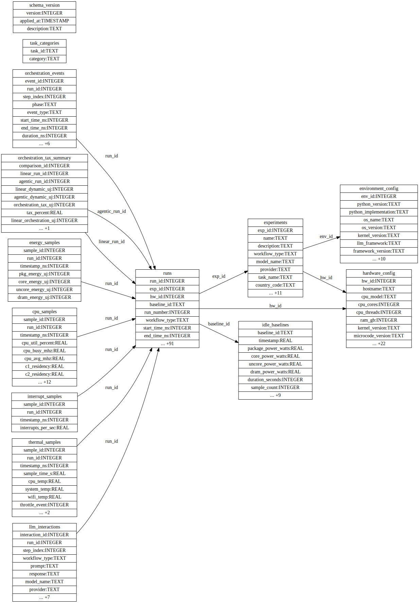

# Database Schema

This document describes the core database schema of A-LEMS, focusing on the main tables every developer should understand.

---

## 📊 Schema Overview

A-LEMS uses a **relational database** with 10+ tables to store complete data lineage. The schema is designed for:

- **Research reproducibility** - Complete provenance of all measurements
- **ML readiness** - Flattened views for model training
- **Performance** - Indexed for fast queries
- **Extensibility** - Easy to add new metrics



*Auto-generated from live database. Always up-to-date.*

---

## 🗄️ Core Tables

### 1. `experiments`

Stores metadata for each experiment session.

| Column | Type | Description |
|--------|------|-------------|
| `exp_id` | INTEGER | Primary key |
| `name` | TEXT | Experiment name |
| `description` | TEXT | Experiment description |
| `workflow_type` | TEXT | 'linear', 'agentic', or 'comparison' |
| `model_name` | TEXT | LLM model used |
| `provider` | TEXT | 'cloud' or 'local' |
| `task_name` | TEXT | Task identifier |
| `country_code` | TEXT | Grid carbon intensity region |
| `created_at` | TIMESTAMP | When experiment started |
| `group_id` | TEXT | Session identifier |
| `status` | TEXT | 'pending', 'running', 'completed', 'failed' |
| `started_at` | TIMESTAMP | Actual start time |
| `completed_at` | TIMESTAMP | Actual end time |
| `error_message` | TEXT | Error if failed |
| `runs_completed` | INTEGER | Number of successful runs |
| `runs_total` | INTEGER | Total planned runs |
| `optimization_enabled` | INTEGER | 0/1 flag |
| `hw_id` | INTEGER | Foreign key to hardware_config |
| `env_id` | INTEGER | Foreign key to environment_config |

**Foreign Keys:**
- `hw_id` → `hardware_config.hw_id`
- `env_id` → `environment_config.env_id`

---

### 2. `hardware_config`

Stores hardware fingerprints for reproducibility across different machines.

| Column | Type | Description |
|--------|------|-------------|
| `hw_id` | INTEGER | Primary key |
| `hardware_hash` | TEXT | Unique hardware fingerprint |
| `hostname` | TEXT | Machine hostname |
| `cpu_model` | TEXT | CPU model name |
| `cpu_cores` | INTEGER | Physical cores |
| `cpu_threads` | INTEGER | Logical threads |
| `ram_gb` | REAL | Total RAM in GB |
| `kernel_version` | TEXT | Linux kernel version |
| `microcode_version` | TEXT | CPU microcode |
| `rapl_domains` | TEXT | JSON array of available RAPL domains |
| `created_at` | TIMESTAMP | Record creation time |

**Additional Hardware Details (if available):**
- `cpu_architecture` - x86_64, arm64, etc.
- `cpu_vendor` - GenuineIntel, AMD, etc.
- `cpu_family` - CPU family ID
- `cpu_model_id` - CPU model ID
- `cpu_stepping` - CPU stepping
- `has_avx2`, `has_avx512`, `has_vmx` - CPU feature flags
- `gpu_model`, `gpu_driver`, `gpu_count` - GPU information
- `gpu_power_available` - GPU power monitoring support
- `rapl_has_dram`, `rapl_has_uncore` - RAPL capabilities
- `system_manufacturer`, `system_product`, `system_type` - System info
- `virtualization_type` - VM detection

---

### 3. `environment_config`

Stores software environment for reproducibility.

| Column | Type | Description |
|--------|------|-------------|
| `env_id` | INTEGER | Primary key |
| `env_hash` | TEXT | Unique environment fingerprint |
| `python_version` | TEXT | Python version |
| `python_implementation` | TEXT | CPython, PyPy, etc. |
| `os_name` | TEXT | Linux, Darwin, Windows |
| `os_version` | TEXT | OS version string |
| `kernel_version` | TEXT | Kernel release |
| `git_commit` | TEXT | Git commit hash |
| `git_branch` | TEXT | Git branch name |
| `git_dirty` | BOOLEAN | Uncommitted changes present |
| `numpy_version` | TEXT | NumPy version if installed |
| `torch_version` | TEXT | PyTorch version if installed |
| `transformers_version` | TEXT | Transformers version if installed |
| `created_at` | TIMESTAMP | Record creation time |

---

### 4. `runs`

Core table storing all experiment run data (80+ columns). This is the main fact table.

| Column Group | Description | Example Columns |
|--------------|-------------|-----------------|
| **Identifiers** | Foreign keys and run info | `run_id`, `exp_id`, `hw_id`, `baseline_id`, `run_number`, `workflow_type` |
| **Timing** | Nanosecond precision timestamps | `start_time_ns`, `end_time_ns`, `duration_ns` |
| **Energy** | Energy in microjoules | `total_energy_uj`, `dynamic_energy_uj`, `pkg_energy_uj`, `core_energy_uj` |
| **Performance** | CPU performance counters | `instructions`, `cycles`, `ipc`, `cache_misses` |
| **Scheduler** | OS scheduling metrics | `context_switches`, `thread_migrations`, `run_queue_length` |
| **Thermal** | Temperature readings | `package_temp_celsius`, `start_temp_c`, `max_temp_c` |
| **C-States** | CPU idle states | `c2_time_seconds`, `c3_time_seconds`, `c6_time_seconds` |
| **Memory** | Memory usage | `rss_memory_mb`, `vms_memory_mb` |
| **Tokens** | LLM token counts | `total_tokens`, `prompt_tokens`, `completion_tokens` |
| **Agentic** | Agent-specific metrics | `planning_time_ms`, `execution_time_ms`, `llm_calls`, `tool_calls` |
| **Sustainability** | Environmental impact | `carbon_g`, `water_ml`, `methane_mg` |
| **Efficiency** | Derived metrics | `energy_per_instruction`, `energy_per_token` |

**Foreign Keys:**
- `exp_id` → `experiments.exp_id`
- `hw_id` → `hardware_config.hw_id`
- `baseline_id` → `idle_baselines.baseline_id`

---

### 5. `idle_baselines`

Stores idle power measurements used for baseline subtraction.

| Column | Type | Description |
|--------|------|-------------|
| `baseline_id` | TEXT | Primary key |
| `timestamp` | REAL | Measurement timestamp |
| `package_power_watts` | REAL | Package idle power |
| `core_power_watts` | REAL | Core idle power |
| `uncore_power_watts` | REAL | Uncore idle power |
| `dram_power_watts` | REAL | DRAM idle power |
| `duration_seconds` | INTEGER | Measurement duration |
| `sample_count` | INTEGER | Number of samples |
| `package_std` | REAL | Standard deviation |
| `core_std` | REAL | Standard deviation |
| `uncore_std` | REAL | Standard deviation |
| `dram_std` | REAL | Standard deviation |
| `governor` | TEXT | CPU governor during measurement |
| `turbo` | TEXT | Turbo boost status |
| `background_cpu` | REAL | Background CPU usage |
| `process_count` | INTEGER | Running processes |
| `method` | TEXT | Measurement method |

---

## 📈 Sample Tables

### 6. `energy_samples`

High-frequency (100Hz) RAPL samples.

| Column | Type | Description |
|--------|------|-------------|
| `sample_id` | INTEGER | Primary key |
| `run_id` | INTEGER | Foreign key to runs |
| `timestamp_ns` | INTEGER | Nanosecond timestamp |
| `pkg_energy_uj` | INTEGER | Package energy (µJ) |
| `core_energy_uj` | INTEGER | Core energy (µJ) |
| `uncore_energy_uj` | INTEGER | Uncore energy (µJ) |
| `dram_energy_uj` | INTEGER | DRAM energy (µJ) |

**Index:** `idx_energy_run_time` on `(run_id, timestamp_ns)`

---

### 7. `cpu_samples`

10Hz CPU telemetry from turbostat.

| Column | Type | Description |
|--------|------|-------------|
| `sample_id` | INTEGER | Primary key |
| `run_id` | INTEGER | Foreign key to runs |
| `timestamp_ns` | INTEGER | Nanosecond timestamp |
| `cpu_util_percent` | REAL | CPU utilization |
| `cpu_busy_mhz` | REAL | Busy frequency |
| `cpu_avg_mhz` | REAL | Average frequency |
| `c1_residency` to `c10_residency` | REAL | C-state residency percentages |
| `package_power` | REAL | Package power (W) |
| `dram_power` | REAL | DRAM power (W) |
| `gpu_rc6` | REAL | GPU RC6 residency |
| `package_temp` | REAL | Package temperature (°C) |
| `ipc` | REAL | Instructions per cycle |
| `extra_metrics_json` | TEXT | JSON blob for additional metrics |

---

### 8. `interrupt_samples`

10Hz interrupt rate samples.

| Column | Type | Description |
|--------|------|-------------|
| `sample_id` | INTEGER | Primary key |
| `run_id` | INTEGER | Foreign key to runs |
| `timestamp_ns` | INTEGER | Nanosecond timestamp |
| `interrupts_per_sec` | REAL | Interrupt rate |

---

### 9. `thermal_samples`

1Hz temperature samples from all thermal zones.

| Column | Type | Description |
|--------|------|-------------|
| `sample_id` | INTEGER | Primary key |
| `run_id` | INTEGER | Foreign key to runs |
| `timestamp_ns` | INTEGER | Nanosecond timestamp |
| `sample_time_s` | REAL | Seconds since run start |
| `cpu_temp` | REAL | CPU temperature (°C) |
| `system_temp` | REAL | System temperature (°C) |
| `wifi_temp` | REAL | WiFi temperature (°C) |
| `throttle_event` | INTEGER | Throttling detected (0/1) |
| `all_zones_json` | TEXT | JSON of all thermal zones |
| `sensor_count` | INTEGER | Number of sensors |

---

## 🧩 Event Tables

### 10. `orchestration_events`

Tracks agentic workflow steps for tax calculation.

| Column | Type | Description |
|--------|------|-------------|
| `event_id` | INTEGER | Primary key |
| `run_id` | INTEGER | Foreign key to runs |
| `step_index` | INTEGER | Step number |
| `phase` | TEXT | 'planning', 'execution', 'synthesis' |
| `event_type` | TEXT | 'llm_call', 'tool_call', 'waiting' |
| `start_time_ns` | INTEGER | Event start |
| `end_time_ns` | INTEGER | Event end |
| `duration_ns` | INTEGER | Event duration |
| `power_watts` | REAL | Power during event |
| `cpu_util_percent` | REAL | CPU utilization |
| `interrupt_rate` | REAL | Interrupt rate |
| `event_energy_uj` | INTEGER | Energy consumed |
| `tax_contribution_uj` | INTEGER | Tax contribution |
| `tax_percent` | REAL | Tax percentage |

---

### 11. `orchestration_tax_summary`

Pre-computed tax metrics per pair of runs.

| Column | Type | Description |
|--------|------|-------------|
| `comparison_id` | INTEGER | Primary key |
| `linear_run_id` | INTEGER | Foreign key to runs |
| `agentic_run_id` | INTEGER | Foreign key to runs |
| `linear_dynamic_uj` | INTEGER | Linear energy |
| `agentic_dynamic_uj` | INTEGER | Agentic energy |
| `orchestration_tax_uj` | INTEGER | Absolute tax (agentic - linear) |
| `tax_percent` | REAL | Tax percentage |
| `linear_orchestration_uj` | INTEGER | Linear orchestration |
| `agentic_orchestration_uj` | INTEGER | Agentic orchestration |

---

## 👁️ Views

### 12. `ml_features`

Flattened view for ML training with 80+ features.

```sql
CREATE VIEW ml_features AS
SELECT
    r.run_id,
    e.workflow_type,
    e.provider,
    r.duration_ns / 1e6 AS duration_ms,
    r.dynamic_energy_uj / 1e6 AS energy_j,
    r.ipc,
    r.cache_miss_rate,
    r.instructions,
    r.cycles,
    -- ... 70+ more columns
FROM runs r
JOIN experiments e ON r.exp_id = e.exp_id;
🔗 Relationships Diagram
text
markdown
### Database Relationships

The database schema follows these key relationships:


text

#### Foreign Key Dependencies

| Source Table | Foreign Key | Target Table | Relationship |
|--------------|-------------|--------------|--------------|
| `runs` | `exp_id` | `experiments` | Many runs belong to one experiment |
| `runs` | `hw_id` | `hardware_config` | Many runs share same hardware |
| `runs` | `env_id` | `environment_config` | Many runs share same environment |
| `energy_samples` | `run_id` | `runs` | One run has many samples |
| `cpu_samples` | `run_id` | `runs` | One run has many CPU samples |
| `interrupt_samples` | `run_id` | `runs` | One run has many interrupt samples |
| `thermal_samples` | `run_id` | `runs` | One run has many thermal samples |
| `orchestration_events` | `run_id` | `runs` | One run has many events |
| `llm_interactions` | `run_id` | `runs` | One run has many LLM interactions |
| `orchestration_tax_summary` | `linear_run_id` | `runs` | Links linear run to tax summary |
| `orchestration_tax_summary` | `agentic_run_id` | `runs` | Links agentic run to tax summary |

#### Cardinality Summary

| Relationship | Type | Description |
|--------------|------|-------------|
| experiments → runs | One-to-Many | One experiment can have multiple runs |
| hardware_config → runs | One-to-Many | Same hardware used for many runs |
| environment_config → runs | One-to-Many | Same environment used for many runs |
| runs → sample tables | One-to-Many | One run generates many samples |
| runs → orchestration_events | One-to-Many | One run generates many events |
| runs → orchestration_tax_summary | One-to-One | One pair generates one tax summary |


## 📊 Sample Queries

### Get Latest Experiment with Hardware

```sql
SELECT 
    e.exp_id,
    e.task_name,
    e.provider,
    h.cpu_model,
    env.python_version,
    env.git_commit
FROM experiments e
LEFT JOIN hardware_config h ON e.hw_id = h.hw_id
LEFT JOIN environment_config env ON e.env_id = env.env_id
ORDER BY e.exp_id DESC
LIMIT 1;
```

### Calculate Average Tax by Provider

```sql
SELECT 
    e.provider,
    AVG(ots.tax_percent) as avg_tax,
    COUNT(*) as samples
FROM orchestration_tax_summary ots
JOIN runs r ON ots.linear_run_id = r.run_id
JOIN experiments e ON r.exp_id = e.exp_id
GROUP BY e.provider;
```

### Get Energy Samples for a Run

```sql
SELECT 
    timestamp_ns,
    pkg_energy_uj / 1e6 as energy_j
FROM energy_samples
WHERE run_id = 977
ORDER BY timestamp_ns;
```

---

## 🔧 Maintenance

### Run Migrations

```bash
python scripts/migrate_db.py
```

### Create Fresh Database

```bash
python scripts/setup_fresh_db.py
```

### Backup Database

```bash
cp data/experiments.db data/experiments.db.backup_$(date +%Y%m%d)
```

---

*This schema document corresponds to the diagram at `../assets/diagrams/database-schema-auto.svg`.*
