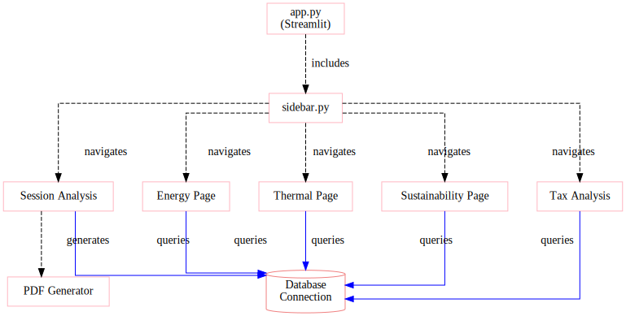

# GUI Design

This document describes the architecture and design of the A-LEMS web-based GUI built with Streamlit.

---

## 🖥️ GUI Overview

The A-LEMS GUI provides an interactive dashboard for:
- **Experiment Management** - Run and monitor experiments
- **Data Visualization** - Charts for energy, thermal, tax analysis
- **Report Generation** - PDF exports of experiment results
- **Database Exploration** - Raw data queries and exploration



---

## 🏗️ Architecture

### Main Entry Point
- `streamlit_app.py` - Main application entry point

### Core Modules

| File | Purpose |
|------|---------|
| `gui/config.py` | Shared configuration and theme settings |
| `gui/db.py` | Database connection management |
| `gui/helpers.py` | Utility functions for charts and formatting |

### Pages (30+)

The `gui/pages/` directory contains all individual pages, organized by category:

| Page | Category | Description |
|------|----------|-------------|
| `overview.py` | Core | System overview dashboard |
| `experiments.py` | Core | Experiment management |
| `execute.py` | Core | Run new experiments |
| `tax.py` | Analysis | Orchestration tax analysis |
| `sustainability.py` | Analysis | Carbon/water/methane metrics |
| `thermal.py` | Analysis | Temperature analysis |
| `explorer.py` | Data | Raw data exploration |
| `sql_query.py` | Data | Custom SQL queries |
| `session_analysis.py` | Reports | PDF report generation |
| `silicon_journey.py` | Research | Special visualization |
| `dq_coverage.py` | Quality | Data quality checks |
| `research_insights.py` | Research | Research findings |

### Page Categories

| Category | Count | Purpose |
|----------|-------|---------|
| **Core Pages** | 5 | Main experiment workflow |
| **Analysis Pages** | 8 | Result analysis and visualization |
| **Data Pages** | 6 | Data exploration and querying |
| **Quality Pages** | 4 | Data quality monitoring |
| **Research Pages** | 3 | Research tools and insights |
| **Reports** | 2 | PDF and report generation |

---

## 🧭 Page Navigation

The sidebar organizes pages into logical categories:

### Experiment Control

| Page | Icon | Description |
|------|------|-------------|
| Execute Run | `▶` | Run new experiments |
| Experiment Designer | `🧪` | Design custom experiment templates |
| Experiments | `≡` | View and manage past experiments |
| Settings | `⚙` | System configuration |

### Exploration

| Page | Icon | Description |
|------|------|-------------|
| Run Explorer | `⊞` | Explore individual run data |
| Sessions | `⬡` | Browse experiment sessions |

### Energy & Compute

| Page | Icon | Description |
|------|------|-------------|
| Energy | `⚡` | Energy consumption analysis |
| Domains | `◉` | RAPL domain breakdown |
| Sustainability | `♻` | Carbon, water, methane metrics |

### Orchestration

| Page | Icon | Description |
|------|------|-------------|
| Tax Attribution | `▲` | Orchestration tax analysis |
| Agentic vs Linear | `⇌` | Compare workflow types |
| Query Analysis | `◑` | LLM query performance |

### System Behavior

| Page | Icon | Description |
|------|------|-------------|
| CPU & C-States | `▣` | CPU frequency and C-state analysis |
| Scheduler | `〜` | Context switch and interrupt analysis |
| Anomalies | `⚠` | Anomaly detection |

### Overview

| Page | Icon | Description |
|------|------|-------------|
| Overview | `◈` | Main dashboard with key metrics |

---

## 🧩 Core Components

### 1. `config.py`

Central configuration for the GUI:

```python
# Paths
PROJECT_ROOT = Path(__file__).parent.parent
DB_PATH = PROJECT_ROOT / "data" / "experiments.db"

# Plotly theme
PL = dict(
    paper_bgcolor="#0f1520",
    plot_bgcolor="#090d13",
    font=dict(color="#7090b0"),
    colorway=["#22c55e", "#ef4444", "#3b82f6"]
)

# Workflow colors
WF_COLORS = {"linear": "#22c55e", "agentic": "#ef4444"}

# Status colors
STATUS_COLORS = {
    "completed": "#3b82f6",
    "running": "#22c55e",
    "pending": "#f59e0b",
    "failed": "#ef4444"
}
```

### 2. `db.py`

Database interface layer:

```python
def q(query: str) -> pd.DataFrame:
    """Execute query and return DataFrame."""
    conn = sqlite3.connect(DB_PATH)
    df = pd.read_sql_query(query, conn)
    conn.close()
    return df

def q1(query: str) -> Any:
    """Execute query returning single value."""
    conn = sqlite3.connect(DB_PATH)
    cursor = conn.execute(query)
    result = cursor.fetchone()
    conn.close()
    return result[0] if result else None
```

### 3. `helpers.py`

Utility functions for data formatting:

```python
def _human_energy(joules: float) -> str:
    """Convert joules to human-readable format."""
    if joules > 20000:
        return f"{joules/20000:.1f} phone charges"
    elif joules > 0.3:
        return f"{joules/0.3:.1f} Google searches"
    else:
        return f"{joules/0.014:.1f} WhatsApp messages"
```

---

## 📄 Page Descriptions

### `overview.py` - Dashboard Home

- System status summary
- Recent experiment cards
- Quick stats (total runs, energy saved, carbon avoided)
- Links to key pages

### `execute.py` - Run Experiments

#### Input Parameters

| Field | Options | Description |
|-------|---------|-------------|
| **Task** | `gsm8k_basic` (default) | Select from 16+ predefined tasks |
| | `gsm8k_multi_step` | Multi-step arithmetic |
| | `logical_reasoning` | Logical deduction |
| | `factual_qa` | Factual questions |
| | *(and 12 more)* | |
| **Provider** | `● local` / `○ cloud` | Local TinyLlama or cloud (Groq/OpenRouter) |
| **Repetitions** | `3` (configurable) | Number of runs for statistical significance |
| **Optimizer** | `[ ] Enable` | Optional runtime optimization |

#### Controls

- `🚀 RUN EXPERIMENT` - Start the experiment with selected parameters

#### Live Progress Display

During execution, you'll see:

```
Progress: [████████░░░░] 4/8 runs completed
```

#### Real-time Results

After each pair of runs, the interface updates:

| Metric | Value |
|--------|-------|
| **Linear Energy** | 1.2 J |
| **Agentic Energy** | 2.6 J |
| **Orchestration Tax** | 2.2x |

#### Complete Workflow

1. Select task and provider
2. Set number of repetitions
3. (Optional) Enable optimizer
4. Click RUN EXPERIMENT
5. Watch live progress
6. View cumulative statistics after completion

### `experiments.py` - Experiment Browser

- Filterable table of all experiments
- Search by task, provider, date
- Quick actions (view, compare, export)
- Summary statistics

### `tax.py` - Orchestration Tax Analysis

#### Tax Multiplier Chart

The chart shows tax multiplier (agentic energy / linear energy) across repetitions.

*Note: In the actual GUI, this is an interactive Plotly chart*

#### Statistical Summary

| Metric | Value | 95% Confidence Interval |
|--------|-------|------------------------|
| **Mean Tax** | 12.5x | [10.2x, 14.8x] |
| **Median Tax** | 11.8x | - |
| **Std Deviation** | 2.3x | - |
| **Min/Max** | 6.2x / 18.9x | - |

#### Interpretation

- **Tax > 1.0** indicates agentic workflow consumes more energy
- **Higher tax** suggests more orchestration overhead
- **Confidence intervals** show statistical significance

#### Key Insights

| Task Type | Typical Tax | Interpretation |
|-----------|-------------|----------------|
| Simple arithmetic | 2-5x | Low orchestration overhead |
| Multi-step logic | 5-15x | Moderate overhead |
| Complex reasoning | 10-30x | High orchestration cost |

#### Orchestration Overhead Index (OOI)

```
OOI = (Agentic Energy - Linear Energy) / Agentic Energy × 100%
```

This represents the fraction of total agentic compute consumed by orchestration overhead.

### `sustainability.py` - Environmental Impact

- Carbon footprint by experiment
- Water usage metrics
- Methane emissions
- Comparison to everyday activities
- Country-specific grid intensity

### `explorer.py` - Raw Data Explorer

- SQL query editor with syntax highlighting
- Results table with export
- Query history
- Schema browser

---

## 🔄 Data Flow

The GUI follows a simple client-server architecture:

### Request Flow

```
Browser → Streamlit Server → Pages → db.py → SQLite DB
```

### Component Responsibilities

| Component | Function |
|-----------|----------|
| **Browser** | User interface, renders HTML/JavaScript |
| **Streamlit Server** | Handles HTTP requests, session state |
| **Pages** | Individual page logic and UI components |
| **db.py** | Database connection and query helpers |
| **SQLite DB** | Persistent data storage |

### Detailed Flow

1. **Browser** sends HTTP request to Streamlit server
2. **Streamlit server** routes to appropriate page
3. **Page** executes logic and may query data via `db.py`
4. **db.py** executes SQL queries against SQLite database
5. **Results** flow back through the chain to the browser
6. **Browser** renders the updated UI

### Key Characteristics

- **Stateless HTTP** - Each request is independent
- **Server-side rendering** - Pages generate HTML on server
- **Connection pooling** - `db.py` manages database connections
- **Session state** - Preserves user data between requests

---

## 🎨 Styling & Theme

### Dark Theme

```css
/* Applied globally */
background-color: #0f1520
text-color: #7090b0
accent-green: #22c55e
accent-red: #ef4444
accent-blue: #3b82f6
```

### Chart Theme (Plotly)

```python
PL = {
    'paper_bgcolor': '#0f1520',
    'plot_bgcolor': '#090d13',
    'font': {'color': '#7090b0'},
    'colorway': ['#22c55e', '#ef4444', '#3b82f6', '#f59e0b']
}
```

---

## 📊 Key Visualizations

### Energy Comparison Chart

```python
fig = px.bar(
    df,
    x='run_number',
    y=['linear_energy_j', 'agentic_energy_j'],
    barmode='group',
    title='Linear vs Agentic Energy',
    color_discrete_map={
        'linear_energy_j': '#22c55e',
        'agentic_energy_j': '#ef4444'
    }
)
```

### Tax Distribution

```python
fig = px.histogram(
    df,
    x='tax_percent',
    nbins=20,
    title='Orchestration Tax Distribution',
    color_discrete_sequence=['#3b82f6']
)
```

### Thermal Profile

```python
fig = px.line(
    df,
    x='time_s',
    y='cpu_temp',
    title='Temperature Over Time',
    line_shape='hv'
)
```

---

## 🔧 Adding a New Page

### Step 1: Create Page File

```python
# gui/pages/new_page.py
import streamlit as st

def render():
    st.title("New Page")
    st.write("Content goes here")
```

### Step 2: Add to Navigation

In `streamlit_app.py`, update `NAV_GROUPS`:

```python
NAV_GROUPS = [
    ("◈ Overview", "overview"),
    ("NEW PAGE", "new_page"),  # ← Add this
    # ... existing entries
]
```

### Step 3: Import in Main

```python
_PAGES = {
    "overview": "gui.pages.overview",
    "new_page": "gui.pages.new_page",  # ← Add this
    # ...
}
```

---

## 📱 Responsive Design

The GUI adapts to different screen sizes:

| Device | Layout | Features |
|--------|--------|----------|
| Desktop | Full sidebar + main | All features |
| Tablet | Collapsible sidebar | Core features |
| Mobile | Hamburger menu | Essential views |

---

## 🔒 Security Considerations

- **No authentication** - Designed for local/trusted networks only
- **CORS warnings** - Can be ignored (see Quick Start guide)
- **Database** - SQLite file permissions must be set
- **External access** - Use `--server.address` to bind to specific interfaces

---

## 🚀 Performance Optimizations

- **Query caching** - Repeated queries use cached results
- **Lazy loading** - Pages load on demand
- **Data sampling** - Large datasets are sampled for display
- **Connection pooling** - Database connections are reused

---

## 📈 Usage Analytics

The GUI tracks (locally only):

- Page views
- Query execution time
- PDF generation count
- Error rates

*No data is sent externally - all metrics stay in local logs.*

---

## 🐛 Debugging

### Enable Debug Mode

```bash
streamlit run streamlit_app.py -- --debug
```

### Common Issues

| Issue | Solution |
|-------|----------|
| Page not found | Check `_PAGES` dictionary in main |
| Chart empty | Verify data in database |
| Slow loading | Add indices to database |
| CORS warnings | Safe to ignore |

---

*This GUI design document corresponds to the diagram at `../assets/diagrams/gui-architecture.svg`.*