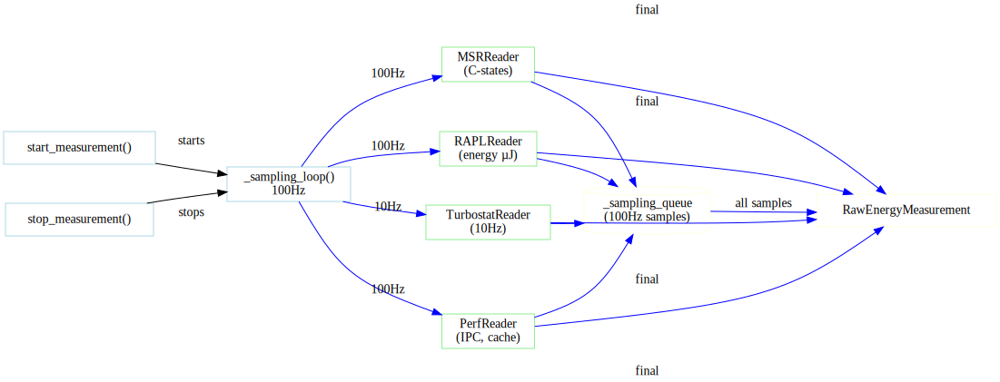

# Adding New Hardware Readers

This guide explains how to extend A-LEMS by adding new hardware readers for additional sensors or metrics.

---

## 🔍 Reader Architecture

All hardware readers follow a common interface pattern:

- **Base Reader** (abstract)
  - `read()` → Dict[str, Any] (required)
  - `calibrate()` (optional)
  - `get_metadata()` (optional)

### Concrete implementations:
- `RAPLReader` - Intel RAPL energy counters
- `MSRReader` - Model-specific registers (C-states, ring bus)
- `PerfReader` - Performance counters (instructions, cache)
- `TurbostatReader` - CPU frequency, temperature
- `SensorReader` - Thermal zone temperatures
- `SchedulerMonitor` - Context switches, interrupts



---

## 📋 Reader Requirements

### Mandatory Methods

| Method | Purpose | Returns |
|--------|---------|---------|
| `__init__(self, config)` | Initialize with hardware config | None |
| `read(self)` | Take a single reading | Dict of metric → value |
| `get_metadata(self)` | Return reader metadata | Dict of static info |

### Optional Methods

| Method | Purpose | When to Implement |
|--------|---------|-------------------|
| `calibrate(self)` | Perform calibration | Sensor needs offset |
| `sample(self)` | High-frequency sampling | Supports >10Hz |
| `close(self)` | Clean up resources | Uses file handles |

---

## 🔧 Harness Integration


---

## 🏗️ Step-by-Step Implementation

### Step 1: Create the Reader Class

Create a new file in `core/readers/`:

```python
# core/readers/my_new_reader.py

import logging
from typing import Dict, Any, Optional
from pathlib import Path

logger = logging.getLogger(__name__)

class MyNewReader:
    """
    Reads [YOUR SENSOR] data from [SOURCE].
    
    This reader provides:
    - Metric 1: Description (units)
    - Metric 2: Description (units)
    - Metric 3: Description (units)
    """
    
    def __init__(self, config: Dict[str, Any]):
        """
        Initialize the reader with hardware configuration.
        
        Args:
            config: Hardware config dict from hw_config.json
                   Expected to contain:
                   - paths: Dict of sensor paths
                   - settings: Reader-specific settings
        """
        self.config = config
        
        # Extract paths from config
        self.paths = config.get('paths', {})
        self.settings = config.get('settings', {})
        
        # Validate required paths
        required_paths = ['sensor1', 'sensor2']
        for path_name in required_paths:
            if path_name not in self.paths:
                logger.warning(f"Missing path: {path_name}")
        
        # Open file handles if needed
        self._open_handles()
        
        logger.info(f"Initialized {self.__class__.__name__}")
    
    def _open_handles(self):
        """Open file handles for continuous reading."""
        self.handles = {}
        for name, path in self.paths.items():
            try:
                self.handles[name] = open(path, 'r')
            except Exception as e:
                logger.error(f"Failed to open {path}: {e}")
    
    def read(self) -> Dict[str, Any]:
        """
        Take a single reading from all sensors.
        
        Returns:
            Dictionary mapping metric names to values.
            Example: {'temperature': 45.2, 'voltage': 12.3}
        """
        readings = {}
        
        for name, handle in self.handles.items():
            try:
                handle.seek(0)
                value = handle.read().strip()
                readings[name] = self._parse_value(value)
            except Exception as e:
                logger.error(f"Failed to read {name}: {e}")
                readings[name] = None
        
        return readings
    
    def _parse_value(self, raw: str) -> float:
        """
        Parse raw string value to float.
        
        Override this for custom parsing logic.
        """
        try:
            return float(raw)
        except ValueError:
            return 0.0
    
    def get_metadata(self) -> Dict[str, Any]:
        """
        Return static metadata about this reader.
        
        Returns:
            Dict with:
            - name: Reader name
            - version: Reader version
            - units: Dict of metric → unit
            - description: Brief description
        """
        return {
            'name': 'My New Reader',
            'version': '1.0.0',
            'units': {
                'metric1': '°C',
                'metric2': 'V',
                'metric3': 'Hz'
            },
            'description': 'Reads data from custom sensor',
            'sampling_rate_hz': self.settings.get('sampling_rate', 10)
        }
    
    def close(self):
        """Clean up file handles."""
        for handle in getattr(self, 'handles', {}).values():
            try:
                handle.close()
            except:
                pass
    
    def __del__(self):
        """Ensure handles are closed on deletion."""
        self.close()
```

---

### Step 2: Add Configuration

#### Update `hw_config.json`

Add your reader's configuration to the hardware detection:

```json
{
  "my_reader": {
    "paths": {
      "sensor1": "/sys/class/my_sensor/sensor1/value",
      "sensor2": "/sys/class/my_sensor/sensor2/value"
    },
    "settings": {
      "sampling_rate": 10,
      "calibration_offset": 0.5
    }
  }
}
```

#### Auto-detection (Optional)

If your sensor can be auto-detected, update `detect_hardware.py`:

```python
def detect_my_reader_paths() -> Dict[str, str]:
    """Auto-detect my sensor paths."""
    paths = {}
    base = Path("/sys/class/my_sensor")
    
    if base.exists():
        for sensor in base.glob("sensor*"):
            value_path = sensor / "value"
            if value_path.exists():
                paths[sensor.name] = str(value_path)
    
    return paths
```

---

### Step 3: Integrate with EnergyEngine

Update `core/energy_engine.py` to include your reader:

```python
class EnergyEngine:
    def __init__(self, config):
        # ... existing readers ...
        
        # Add your new reader
        if 'my_reader' in config:
            from core.readers.my_new_reader import MyNewReader
            self.my_reader = MyNewReader(config['my_reader'])
        else:
            self.my_reader = None
    
    def start_measurement(self):
        # ... existing start code ...
        
        if self.my_reader:
            # Start sampling if needed
            pass
        
        return self.measurement_id
    
    def stop_measurement(self):
        # ... existing stop code ...
        
        my_reader_samples = []
        if self.my_reader:
            # Collect samples
            my_reader_samples = self.my_reader.get_samples()
        
        # Add to RawEnergyMeasurement
        raw.my_reader_samples = my_reader_samples
        
        return raw
```

---

### Step 4: Add Database Storage

#### Update Schema

Add your reader's table to `core/database/schema.py`:

```python
CREATE_MY_READER_SAMPLES = """
CREATE TABLE IF NOT EXISTS my_reader_samples (
    sample_id INTEGER PRIMARY KEY AUTOINCREMENT,
    run_id INTEGER NOT NULL,
    timestamp_ns INTEGER NOT NULL,
    metric1 REAL,
    metric2 REAL,
    metric3 REAL,
    extra_json TEXT,
    FOREIGN KEY(run_id) REFERENCES runs(run_id)
);
CREATE INDEX idx_my_reader_run ON my_reader_samples(run_id);
"""
```

#### Add to ALL_TABLES

```python
ALL_TABLES = [
    # ... existing tables ...
    ("my_reader_samples", CREATE_MY_READER_SAMPLES),
]
```

#### Add Repository Methods

In `core/database/repositories/samples.py`:

```python
def insert_my_reader_samples(self, run_id: int, samples: List[Dict]):
    """Insert my reader samples."""
    if not samples:
        return
    
    rows = []
    for s in samples:
        rows.append((
            run_id,
            s['timestamp_ns'],
            s.get('metric1'),
            s.get('metric2'),
            s.get('metric3'),
            json.dumps({k:v for k,v in s.items() 
                       if k not in ['timestamp_ns', 'metric1', 'metric2', 'metric3']})
        ))
    
    with self.db.transaction():
        self.db.executemany("""
            INSERT INTO my_reader_samples 
            (run_id, timestamp_ns, metric1, metric2, metric3, extra_json)
            VALUES (?, ?, ?, ?, ?, ?)
        """, rows)
```

---

### Step 5: Test Your Reader

#### Unit Test

```python
# tests/test_readers/test_my_reader.py

import pytest
from core.readers.my_new_reader import MyNewReader

def test_my_reader_initialization():
    config = {
        'paths': {
            'sensor1': '/test/path/sensor1',
            'sensor2': '/test/path/sensor2'
        }
    }
    reader = MyNewReader(config)
    assert reader is not None

def test_my_reader_read():
    # Mock file reading
    # Test parsing logic
    pass
```

#### Integration Test

```python
# scripts/test_my_reader.py

from core.energy_engine import EnergyEngine
from core.config_loader import ConfigLoader

config = ConfigLoader().get_hardware_config()
engine = EnergyEngine(config)

with engine.start_measurement():
    time.sleep(1)

raw = engine.stop_measurement()
print(f"Got {len(raw.my_reader_samples)} samples")
```

---

### Step 6: Add to GUI

#### Create Visualization Page

```python
# gui/pages/my_reader.py

import streamlit as st
import pandas as pd
from gui.db import q

def render():
    st.title("My Reader Data")
    
    run_id = st.number_input("Run ID", min_value=1)
    
    df = q(f"""
        SELECT timestamp_ns, metric1, metric2, metric3
        FROM my_reader_samples
        WHERE run_id = {run_id}
        ORDER BY timestamp_ns
    """)
    
    if not df.empty:
        st.line_chart(df.set_index('timestamp_ns'))
```

---

## 🎯 Best Practices

### 1. Error Handling

```python
def read(self):
    try:
        value = self._read_sensor()
        return {'metric': value}
    except FileNotFoundError:
        logger.error("Sensor not found")
        return {'metric': None}
    except PermissionError:
        logger.error("Permission denied - run fix_permissions.sh")
        return {'metric': None}
```

### 2. Performance

- Use file handles for repeated reads (don't open/close each time)
- Batch readings when possible
- Cache metadata that doesn't change

### 3. Units & Types

Always document units clearly:

```python
def get_metadata(self):
    return {
        'units': {
            'temperature': '°C',
            'voltage': 'V',
            'frequency': 'Hz'
        }
    }
```

### 4. Sampling Rates

```python
@property
def sampling_rate_hz(self):
    """Return maximum supported sampling rate."""
    return self.config.get('settings', {}).get('sampling_rate', 1)
```

---

## 📚 Example Readers

Study these existing readers for reference:

| Reader | File | Key Techniques |
|--------|------|----------------|
| `RAPLReader` | `rapl_reader.py` | File handles, multiple domains |
| `MSRReader` | `msr_reader.py` | Binary data, register access |
| `SensorReader` | `sensor_reader.py` | Dynamic discovery, thermal zones |
| `SchedulerMonitor` | `scheduler_monitor.py` | `/proc` parsing, interrupt sampling |

---

## 🚀 Complete Example: Voltage Reader

```python
# core/readers/voltage_reader.py

class VoltageReader:
    """
    Reads system voltages from hwmon sensors.
    
    Provides:
    - CPU voltage (V)
    - DRAM voltage (V)
    - PCH voltage (V)
    """
    
    def __init__(self, config):
        self.paths = config.get('paths', {})
        self.handles = {}
        
        for name, path in self.paths.items():
            try:
                self.handles[name] = open(path, 'r')
            except Exception as e:
                logger.error(f"Failed to open {path}: {e}")
    
    def read(self):
        voltages = {}
        for name, handle in self.handles.items():
            try:
                handle.seek(0)
                # hwmon returns millivolts
                mv = int(handle.read().strip())
                voltages[name] = mv / 1000.0  # Convert to volts
            except:
                voltages[name] = None
        return voltages
    
    def get_metadata(self):
        return {
            'name': 'Voltage Reader',
            'units': {'cpu': 'V', 'dram': 'V', 'pch': 'V'},
            'sampling_rate': 10
        }
```

---

## ✅ Checklist for New Readers

- [ ] Reader class implements `read()` and `get_metadata()`
- [ ] Error handling for missing sensors/permissions
- [ ] Unit tests for parsing logic
- [ ] Integration test with EnergyEngine
- [ ] Database schema updated
- [ ] GUI page added (optional)
- [ ] Documentation updated
- [ ] Example usage in docstring

---

## 🔍 Debugging Tips

### Check Permissions

```bash
# Run permission fixer
sudo ./scripts/fix_permissions.sh

# Test read directly
cat /sys/class/my_sensor/sensor1/value
```

### Logging

```python
import logging
logger = logging.getLogger(__name__)

def read(self):
    logger.debug(f"Reading from {self.paths}")
    value = self._read()
    logger.debug(f"Got value: {value}")
    return value
```

### Debug Mode

```bash
export A_LEMS_DEBUG=1
python -m core.execution.tests.test_harness --task-id simple
```

---

*This guide corresponds to the Energy Engine diagram at `../assets/diagrams/energy-engine.svg`.*