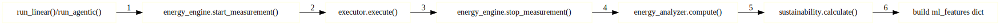

# Adding New Experiment Tasks

This guide explains how to add new tasks to A-LEMS for both linear and agentic experiments.

---

## 📋 Task Overview

Tasks are defined in `config/tasks.yaml` and follow a simple structure:

```yaml
task_id:
  description: "Human-readable description"
  level: 1|2|3
  tools: 0|1|2|...
  prompt: "The actual task prompt for the LLM"
  expected_output: "Expected answer (optional)"
```



---

## 🎯 Task Levels

| Level | Description | Example | Tool Usage |
|-------|-------------|---------|------------|
| **1** | Simple tasks | Factual QA, basic math | 0 tools (LLM only) |
| **2** | Moderate complexity | Multi-step reasoning | 1-2 tools |
| **3** | Complex tasks | Research synthesis | 3+ tools |

---

## 📝 Task Definition Fields

| Field | Required | Type | Description |
|-------|----------|------|-------------|
| `description` | ✅ Yes | String | Human-readable description |
| `level` | ✅ Yes | Integer | 1, 2, or 3 |
| `tools` | ✅ Yes | Integer | Number of tools available |
| `prompt` | ✅ Yes | String | The actual prompt sent to LLM |
| `expected_output` | ❌ No | String | For validation/accuracy checking |

---

## 🏗️ Step-by-Step: Adding a Task

### Step 1: Edit `config/tasks.yaml`

```yaml
# config/tasks.yaml

tasks:
  # Existing tasks...
  
  my_new_task:
    description: "My Custom Task Description"
    level: 2
    tools: 1
    prompt: |
      Solve this problem step by step:
      A train leaves Chicago at 2 PM traveling at 60 mph.
      Another train leaves New York at 3 PM traveling at 70 mph.
      The distance between cities is 800 miles.
      When will they meet?
    expected_output: "8:00 PM"
```

### Step 2: Verify Task Loads

```bash
# List all tasks to verify
python -m core.execution.tests.run_experiment --list-tasks
```

You should see your new task in the list:

```
📋 Available Tasks:
----------------------------------------------------------------------
ID              Name                      Level    Tools   
----------------------------------------------------------------------
my_new_task     My Custom Task            2        1       
...
```

---

## 🧪 Task Types by Level

### Level 1: Simple Tasks (LLM Only)

```yaml
factual_qa:
  description: "Factual Question"
  level: 1
  tools: 0
  prompt: "What is the capital of France?"
  expected_output: "Paris"

science_qa:
  description: "Science Question"
  level: 1
  tools: 0
  prompt: "What is the chemical symbol for gold?"
  expected_output: "Au"
```

### Level 2: Moderate Tasks (1-2 Tools)

```yaml
gsm8k_basic:
  description: "GSM8K Arithmetic"
  level: 2
  tools: 1
  prompt: |
    Natalia sold clips to 48 of her friends in April, 
    and then she sold half as many clips in May. 
    How many clips did Natalia sell altogether in April and May?
  expected_output: "72"

logical_reasoning:
  description: "Logical Deduction"
  level: 2
  tools: 1
  prompt: |
    All humans are mortal. Socrates is human. 
    Therefore, Socrates is mortal. Is this valid?
  expected_output: "Yes"
```

### Level 3: Complex Tasks (3+ Tools)

```yaml
research_summary:
  description: "Research Abstract Summary"
  level: 3
  tools: 3
  prompt: |
    Summarize the key findings from this research paper abstract:
    [PAPER TEXT HERE]
    Include methodology, results, and conclusions.
  expected_output: "The paper presents..."
```

---

## 🔧 Task with Multiple Tools

```yaml
complex_math:
  description: "Complex Multi-step Math"
  level: 3
  tools: 2
  prompt: |
    Calculate the compound interest on $5000 invested for 3 years
    at 4.5% annual rate compounded monthly.
    Then calculate the equivalent simple interest.
    Finally, find the difference between the two.
  expected_output: "Compound: $723.37, Simple: $675.00, Difference: $48.37"
```

The agentic executor will:

1. Plan the steps
2. Use calculator tool for each calculation
3. Synthesize results

---

## 📊 Task Categories

You can also organize tasks by category in `config/task_categories.yaml`:

```yaml
# config/task_categories.yaml

math:
  - gsm8k_basic
  - gsm8k_multi_step
  - complex_math

reasoning:
  - logical_reasoning
  - commonsense_reasoning

qa:
  - factual_qa
  - science_qa
  - geography_qa

code:
  - code_fibonacci
  - code_sorting
  - bug_fixing
```

Query by category:

```sql
SELECT * FROM task_categories WHERE category = 'math';
```

---

## 🧠 How Tasks Are Executed

### Linear Execution

```python
# In LinearExecutor.execute()
def execute(self, prompt):
    # Single LLM call
    response = self._call_llm(prompt)
    return response
```

### Agentic Execution

```python
# In AgenticExecutor.execute()
def execute(self, task):
    # Phase 1: Planning
    plan = self._create_plan(task)
    
    # Phase 2: Execution
    results = []
    for step in plan['steps']:
        if step['type'] == 'tool':
            result = self._execute_tool(step['tool'], step['args'])
        else:
            result = self._call_llm(step['prompt'])
        results.append(result)
    
    # Phase 3: Synthesis
    final = self._synthesize(task, plan, results)
    return final
```

---

## 📈 Task Complexity Score

The system automatically calculates complexity:

```python
def _calculate_complexity_score(llm_calls, tool_calls, total_tokens):
    """
    Complexity = weighted combination of:
    - LLM calls (α=0.4) - each model invocation
    - Tool calls (β=0.3) - external operations
    - Token volume (γ=0.3) - computation scale
    """
    normalized_llm = min(llm_calls / 10, 1.0)
    normalized_tools = min(tool_calls / 10, 1.0)
    normalized_tokens = min(total_tokens / 1000, 1.0)
    
    return (0.4 * normalized_llm + 
            0.3 * normalized_tools + 
            0.3 * normalized_tokens)
```

Stored in `runs.complexity_score`.

---

## 🛠️ Adding Tool Support for Tasks

If your task needs a new tool, add it in `agentic.py`:

```python
def _execute_tool(self, name: str, args: Dict) -> Any:
    if name == "calculator":
        return self._run_calculator(args)
    elif name == "web_search":
        return self._run_web_search(args)
    elif name == "my_new_tool":  # ← Add your tool
        return self._run_my_new_tool(args)
    else:
        raise ValueError(f"Unknown tool: {name}")

def _run_my_new_tool(self, args: Dict) -> Any:
    """Implement your custom tool logic."""
    # Parse args
    input_data = args.get('input')
    
    # Your tool logic here
    result = process_data(input_data)
    
    # Track for metrics
    self._tool_calls += 1
    
    return result
```

---

## ✅ Task Validation

### Check Expected Output

```python
def validate_result(actual: str, expected: str) -> bool:
    """Check if task result matches expected."""
    if not expected:
        return True  # No validation
    
    # Simple exact match
    if actual.strip() == expected.strip():
        return True
    
    # Numeric tolerance for math tasks
    try:
        actual_num = float(actual)
        expected_num = float(expected)
        return abs(actual_num - expected_num) < 0.01
    except:
        pass
    
    return False
```

Stored in `runs.task_success` (to be added).

---

## 📝 Task Documentation Template

When adding a new task, document it in `docs/user-guide/tasks.md`:

```markdown
## `my_new_task`

**Level:** 2  
**Tools:** 1 (calculator)  
**Description:** My custom task description

### Prompt

Solve this problem step by step:
A train leaves Chicago at 2 PM traveling at 60 mph.
Another train leaves New York at 3 PM traveling at 70 mph.
The distance between cities is 800 miles.
When will they meet?

### Expected Behavior

1. LLM plans steps (distance calculation, relative speed, time)
2. Uses calculator for each step
3. Synthesizes final answer

### Example Output

```
Step 1: Calculate relative speed
60 mph + 70 mph = 130 mph

Step 2: Calculate time to meet
800 miles ÷ 130 mph = 6.15 hours

Step 3: Add to Chicago departure time
2 PM + 6 hours = 8 PM
0.15 hours = 9 minutes

They will meet at 8:09 PM.
```

### Expected Answer: `8:09 PM`
```

---

## 🧪 Testing Your New Task

### Quick Test

```bash
# Test linear execution
python -m core.execution.tests.test_harness \
    --task-id my_new_task \
    --repetitions 1 \
    --provider local \
    --verbose

# Test agentic execution (if tools needed)
python -m core.execution.tests.test_harness \
    --task-id my_new_task \
    --repetitions 1 \
    --provider local \
    --agentic \
    --verbose
```

### Batch Test

```bash
python -m core.execution.tests.run_experiment \
    --tasks my_new_task \
    --repetitions 5 \
    --providers local,cloud \
    --save-db
```

---

## 📊 Analyzing Task Performance

### Query Task Results

```sql
SELECT 
    r.run_id,
    r.workflow_type,
    r.dynamic_energy_uj/1e6 as energy_j,
    r.duration_ns/1e9 as duration_s,
    r.llm_calls,
    r.tool_calls,
    r.complexity_score
FROM runs r
JOIN experiments e ON r.exp_id = e.exp_id
WHERE e.task_name = 'my_new_task'
ORDER BY r.run_id;
```

### Compare Across Tasks

```sql
SELECT 
    e.task_name,
    e.provider,
    AVG(r.dynamic_energy_uj/1e6) as avg_energy,
    AVG(r.duration_ns/1e9) as avg_duration,
    AVG(r.complexity_score) as avg_complexity
FROM runs r
JOIN experiments e ON r.exp_id = e.exp_id
GROUP BY e.task_name, e.provider
ORDER BY avg_energy DESC;
```

---

## 🎯 Best Practices

### 1. Clear Prompts

✅ **Good:**

```yaml
prompt: "Calculate 15% tip on a $45.50 meal."
```

❌ **Bad:**

```yaml
prompt: "do math"
```

### 2. Appropriate Level

- **Level 1**: Questions answerable in one LLM call
- **Level 2**: Requires 2-3 steps, may use tools
- **Level 3**: Multi-step with multiple tools

### 3. Include Expected Output

Always include expected output for validation:

```yaml
expected_output: "6.83"
```

### 4. Test Both Providers

```bash
# Test with local (faster for iteration)
python -m core.execution.tests.test_harness --task-id my_task --provider local

# Test with cloud (production)
python -m core.execution.tests.test_harness --task-id my_task --provider cloud
```

---

## 🚀 Advanced: Dynamic Tasks

You can also generate tasks programmatically:

```python
# scripts/generate_tasks.py

def generate_math_tasks(base=2, count=10):
    """Generate multiplication tasks of varying difficulty."""
    tasks = {}
    for i in range(count):
        a = random.randint(1, 10**base)
        b = random.randint(1, 10**base)
        task_id = f"multiply_{base}_{i}"
        tasks[task_id] = {
            'description': f"Multiply {a} × {b}",
            'level': min(3, base),
            'tools': 1,
            'prompt': f"Calculate {a} × {b}",
            'expected_output': str(a * b)
        }
    return tasks
```

Then merge with `tasks.yaml`.

---

## ✅ Checklist for New Tasks

- [ ] Task ID is unique and descriptive
- [ ] Description clearly explains the task
- [ ] Level appropriate for complexity
- [ ] Tools count matches actual tool usage
- [ ] Prompt is clear and unambiguous
- [ ] Expected output included (if applicable)
- [ ] Tested with local provider
- [ ] Tested with cloud provider (if available)
- [ ] Documented in user guide
- [ ] Added to appropriate category

---

## 🔍 Debugging Task Issues

### Task Not Found

```bash
python -m core.execution.tests.run_experiment --list-tasks
# Verify your task appears in the list
```

### Tool Not Supported

**Error:** `Unknown tool: my_tool`

**Fix:** Add tool to `agentic.py` `_execute_tool()` method.

### Wrong Complexity Level

Check calculated score:

```sql
SELECT run_id, complexity_score, llm_calls, tool_calls 
FROM runs WHERE task_name = 'my_task';
```

---

*This guide corresponds to the Harness diagram at `../assets/diagrams/harness.svg`.*