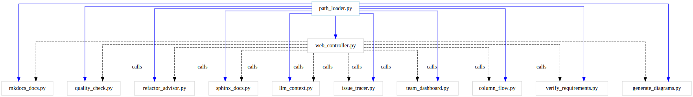

# Developer Tools Overview

A-LEMS includes 11 developer tools for automation, debugging, and maintenance. All tools are located in `scripts/tools/` and follow a consistent interface.

---

## 🛠️ Tool Categories

| Category | Tools | Purpose |
|----------|-------|---------|
| **Code Analysis** | `llm_context.py`, `column_flow.py`, `refactor_advisor.py` | Understand and analyze code |
| **Documentation** | `sphinx_docs.py`, `mkdocs_docs.py`, `generate_diagrams.py` | Generate documentation |
| **Quality** | `quality_check.py`, `verify_requirements.py` | Maintain code quality |
| **Team** | `team_dashboard.py` | Team insights and bus factor |
| **Web UI** | `web_controller.py` | One-stop interface for all tools |
| **Diagnostics** | `issue_tracer.py` | System health checks |

---

## 🔧 Tools Dependency Graph



---

## 📋 Tool 1: `llm_context.py` - LLM Context Generator

**Purpose:** Generate complete code context for LLM prompts.

```bash
python scripts/tools/llm_context.py --change "add column to runs table"
```

**Output:** Schema, related files, data flow, dependencies.

**Use when:** You need to ask an LLM to generate code changes.

---

## 📋 Tool 2: `sphinx_docs.py` - API Documentation

**Purpose:** Generate developer API docs from Python docstrings.

```bash
# Build documentation
python scripts/tools/sphinx_docs.py --build

# Open in browser
python scripts/tools/sphinx_docs.py --open
```

**Output:** HTML/PDF documentation in `docs/generated/sphinx/`.

**Use when:** You need technical reference documentation.

---

## 📋 Tool 3: `mkdocs_docs.py` - User Documentation

**Purpose:** Generate user-friendly guides and tutorials.

```bash
# Build documentation
python scripts/tools/mkdocs_docs.py --build

# Serve locally for preview
python scripts/tools/mkdocs_docs.py --serve

# Initialize config file
python scripts/tools/mkdocs_docs.py --init
```

**Output:** Website in `docs/generated/mkdocs/`.

**Use when:** Users need to understand how to use A-LEMS.

---

## 📋 Tool 4: `quality_check.py` - Code Quality Guardian

**Purpose:** Run comprehensive quality checks.

```bash
# Standard check
python scripts/tools/quality_check.py

# Verbose output
python scripts/tools/quality_check.py --verbose
```

**Checks:** Pylint, mypy, radon, bandit, vulture, black, isort.

**Use when:** Before committing code.

---

## 📋 Tool 5: `refactor_advisor.py` - Refactoring Advisor

**Purpose:** Suggest code structure improvements.

```bash
python scripts/tools/refactor_advisor.py --target core/execution/harness.py
```

**Output:** Duplicate code detection, complexity hotspots, split suggestions.

**Use when:** Code feels messy or hard to maintain.

---

## 📋 Tool 6: `team_dashboard.py` - Collaboration Dashboard

**Purpose:** Show team activity and knowledge gaps.

```bash
# Default (30 days)
python scripts/tools/team_dashboard.py

# Custom time period
python scripts/tools/team_dashboard.py --days 90
```

**Output:** Bus factor analysis, ownership map, activity hotspots.

**Use when:** Onboarding new team members or identifying risks.

---

## 📋 Tool 7: `web_controller.py` - Web UI

**Purpose:** One-stop UI for all developer tools.

```bash
python scripts/tools/web_controller.py
# Opens http://localhost:8888
```

**Features:** Buttons for all tools, real-time output, column flow tracer.

**Use when:** You want a GUI instead of command line.

---

## 📋 Tool 8: `verify_requirements.py` - Requirements Verifier

**Purpose:** Compare specifications against actual code.

```bash
# Default check
python scripts/tools/verify_requirements.py

# Custom spec file
python scripts/tools/verify_requirements.py --spec docs/requirements.yaml
```

**Output:** What's implemented, partially done, missing.

**Use when:** Tracking project progress or preparing releases.

---

## 📋 Tool 9: `column_flow.py` - Column Flow Analyzer

**Purpose:** Trace how database columns get their data.

```bash
python scripts/tools/column_flow.py --table runs --column pkg_energy_uj
```

**Output:** INSERT locations, data sources, transformations.

**Use when:** Debugging data issues or adding new columns.

---

## 📋 Tool 10: `generate_diagrams.py` - Diagram Generator

**Purpose:** Create architecture and dependency diagrams.

```bash
# Generate all diagrams
python scripts/tools/generate_diagrams.py

# Generate specific diagram
python scripts/tools/generate_diagrams.py --name architecture

# Watch mode
python scripts/tools/generate_diagrams.py --watch
```

**Output:** SVG files in `../assets/diagrams/`.

**Use when:** Updating documentation or preparing papers.

---

## 📋 Tool 11: `issue_tracer.py` - Issue Auto-Diagnoser

**Purpose:** Find root causes of problems automatically.

```bash
# Run all checks
python scripts/tools/issue_tracer.py

# Verbose output
python scripts/tools/issue_tracer.py --verbose

# Save to file
python scripts/tools/issue_tracer.py --output report.txt
```

**Output:** Comprehensive system health report.

**Use when:** Something is broken and you don't know why.

---

## 🔧 Path Configuration

All tools use `path_loader.py` for centralized path management:

```python
from scripts.tools.path_loader import config

print(f"Project root: {config.ROOT}")
print(f"Database: {config.DB_PATH}")
print(f"Diagrams output: {config.DIAGRAMS_OUTPUT}")
print(f"MkDocs source: {config.MKDOCS_SOURCE}")
```

---

## 📁 Tools Overview

The `scripts/tools/` directory contains all developer tools:

| Tool | Purpose |
|------|---------|
| `path_loader.py` | Centralized path configuration |
| `llm_context.py` | Generate context for LLM prompts |
| `sphinx_docs.py` | Build API documentation |
| `mkdocs_docs.py` | Build user documentation |
| `quality_check.py` | Run code quality checks |
| `refactor_advisor.py` | Suggest refactoring improvements |
| `team_dashboard.py` | Team activity insights |
| `web_controller.py` | Web UI for all tools |
| `verify_requirements.py` | Compare specs vs code |
| `column_flow.py` | Trace database column data flow |
| `generate_diagrams.py` | Generate system diagrams |
| `diagram_processor.py` | Core diagram rendering logic |
| `issue_tracer.py` | System diagnostics |

---

## 🚀 Quick Reference

| Tool | Command |
|------|---------|
| LLM Context | `llm_context.py --change "..."` |
| API Docs | `sphinx_docs.py --build` |
| User Docs | `mkdocs_docs.py --build` |
| Quality | `quality_check.py` |
| Refactoring | `refactor_advisor.py --target FILE` |
| Team | `team_dashboard.py` |
| Web UI | `web_controller.py` |
| Requirements | `verify_requirements.py` |
| Column Flow | `column_flow.py --table T --column C` |
| Diagrams | `generate_diagrams.py` |
| Issue Tracer | `issue_tracer.py` |

---

## ➕ Adding New Tools

To add a new tool:

1. Create a new Python file in `scripts/tools/`
2. Follow the existing pattern (argparse, main function)
3. Use `path_loader.py` for all paths
4. Add to `web_controller.py` `tool_scripts` dict
5. Update `requirements-tools.txt` if needed
6. Add to this document
7. Test with `--help` flag

**Example template:**

```python
#!/usr/bin/env python3
"""
New Tool Description
"""

import argparse
import sys
from pathlib import Path

sys.path.append(str(Path(__file__).parent))
from path_loader import config

def main():
    parser = argparse.ArgumentParser()
    parser.add_argument("--option", help="Description")
    args = parser.parse_args()
    
    # Your tool logic here
    print(f"Using config: {config.ROOT}")

if __name__ == "__main__":
    main()
```