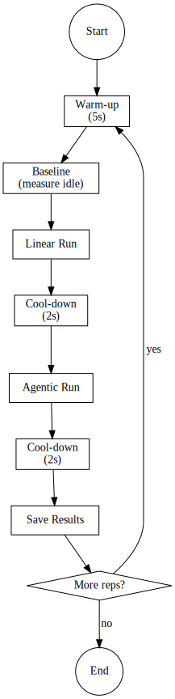

# 🚀 Step 10: Quick Start - First Experiment

Run your first experiment in 5 minutes!

---

## 🔄 Experiment Lifecycle

Each experiment follows this lifecycle:



---

## ✅ Prerequisites Check

Before starting, ensure you've completed:

- [x] Hardware detection (`scripts/detect_hardware.py`)
- [x] Environment detection (`scripts/detect_environment.py`)
- [x] Database setup (`scripts/setup_fresh_db.py`)
- [x] Model configuration (API keys in `.env`)
- [x] LLM verification (`test_llm_setup.py`)

---

## ⚡ Quick Start Commands

### 1. List Available Tasks

```bash
python -m core.execution.tests.run_experiment --list-tasks
```

### 2. Run a Simple Local Experiment

```bash
python -m core.execution.tests.run_experiment \
    --tasks gsm8k_basic \
    --repetitions 1 \
    --providers local \
    --save-db \
    --verbose
```

### 3. View Results

```bash
# Check the database
sqlite3 data/experiments.db "SELECT run_id, workflow_type, dynamic_energy_uj/1e6 as energy_j FROM runs LIMIT 5;"

# Launch the GUI
streamlit run streamlit_app.py
```

### 4. Generate a PDF Report

1. Open browser at `http://localhost:8501`
2. Navigate to **Session Analysis**
3. Find your experiment
4. Click **Generate PDF Report**

---

## 📊 What You'll See

**Console Output:**
```
📊 Progress: 1/1 runs
  Linear: 1.2043 J
  Agentic: 2.5945 J
  Tax: 2.15x
✅ Pair 1 saved (linear: 1, agentic: 2)
```

**GUI Dashboard:**
- Energy comparison charts
- Orchestration tax analysis
- Thermal profiles
- Sustainability metrics

---

## 🧪 Try Another Task

```bash
python -m core.execution.tests.run_experiment \
    --tasks gsm8k_multi_step \
    --repetitions 3 \
    --providers local \
    --save-db
```

---

## 🔧 Quick Troubleshooting

| Issue | Solution |
|-------|----------|
| `Permission denied` | `sudo ./scripts/fix_permissions.sh` |
| No results in DB | Did you use `--save-db`? |
| Blank GUI | Check `streamlit` is installed |
| No diagrams | Run `python scripts/tools/generate_diagrams.py` |

---

## ✅ Next Steps

- [Understanding Metrics](../user-guide/02-understanding-metrics.md)
- [Running Batch Experiments](../user-guide/03-batch-experiments.md)
- [Using the GUI](../user-guide/04-gui-usage.md)

---

> **Congratulations!** You've successfully run your first A-LEMS experiment! 🎉