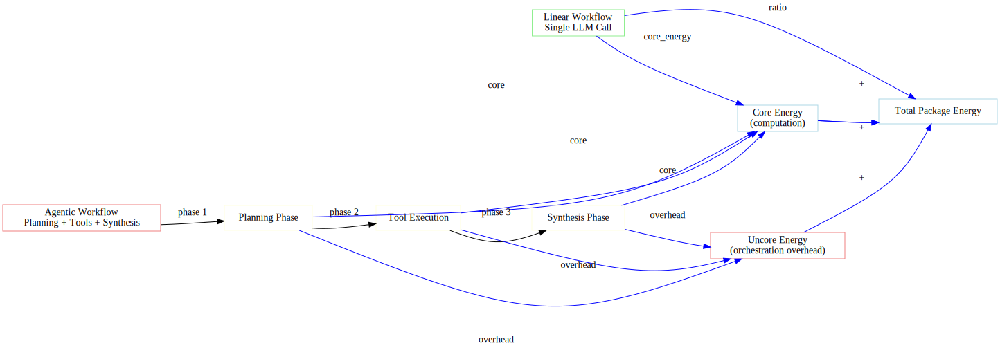

# Orchestration Tax Framework

This document presents the Orchestration Overhead Index (OOI) framework for quantifying agentic AI overhead.

---

## 🎯 Core Concept

The **orchestration tax** is the additional energy consumed by agentic workflows compared to linear execution of the same task.

```
Linear: [LLM Call] → Answer

Agentic: [Plan] → [Tool] → [Reason] → [Tool] → [Synthesize] → Answer
                                            ↑
                                Orchestration Tax (overhead)
```

---

## 📊 Orchestration Tax Visualization

The diagram below shows the energy difference between linear and agentic workflows:



---

## 📈 Mathematical Definition

### Basic Tax

$$T_{basic} = \frac{E_{agentic}}{E_{linear}}$$

### Tax Percentage

$$T_{\%} = \frac{E_{agentic} - E_{linear}}{E_{agentic}} \times 100\%$$

---

## 🔬 Uncore Attribution Proof

From first principles:

$$
\begin{aligned}
E_{total} &= E_{core} + E_{uncore} \\
E_{idle} &= E_{idle,core} + E_{idle,uncore} \\
E_{workload} &= (E_{core} - E_{idle,core}) + (E_{uncore} - E_{idle,uncore}) \\
E_{reasoning} &= E_{core} - E_{idle,core} \\
E_{tax} &= E_{uncore} - E_{idle,uncore}
\end{aligned}
$$

**Therefore:** Orchestration tax equals uncore energy minus idle uncore energy.

---

## 🧠 Phase-Level Attribution

### Phase Energy Decomposition

$$E_{agentic} = E_{planning} + E_{execution} + E_{synthesis}$$

### Phase Tax Contribution

$$T_{phase} = \frac{E_{phase} - E_{phase,linear}}{E_{agentic}} \times 100\%$$

Where $E_{phase,linear}$ is the energy the linear workflow would have spent on equivalent computation.

---

## 📊 Orchestration Overhead Index (OOI)

### Definition

$$OOI = \frac{E_{agentic}}{E_{linear}} \cdot \left(1 + \frac{t_{planning} + t_{synthesis}}{t_{execution}}\right)$$

### Components

| Component | Description | Weight |
|-----------|-------------|--------|
| $\frac{E_{agentic}}{E_{linear}}$ | Energy multiplier | Primary |
| $t_{planning}$ | Planning time | Overhead |
| $t_{synthesis}$ | Synthesis time | Overhead |
| $t_{execution}$ | Tool execution time | Baseline |

### Interpretation

| OOI Range | Interpretation |
|-----------|----------------|
| 1.0 - 1.5 | Low overhead |
| 1.5 - 3.0 | Moderate overhead |
| 3.0 - 5.0 | High overhead |
| > 5.0 | Extreme overhead |

---

## 🔄 Workflow Phase Analysis

### Phase Definitions

```
Planning Phase
    ↓
Execution Phase (Step 1)
    ↓
Execution Phase (Step 2)
    ↓
    ...
    ↓
Execution Phase (Step n)
    ↓
Synthesis Phase
```

### Phase Energy

$$E_{planning} = \int_{t_0}^{t_1} P(t) dt$$

$$E_{execution} = \sum_{i=1}^{n} \int_{t_{i,start}}^{t_{i,end}} P(t) dt$$

$$E_{synthesis} = \int_{t_n}^{t_{final}} P(t) dt$$

---

## 📊 Tax Distribution Analysis

### Per-Step Tax

$$T_{step} = \frac{E_{step} - E_{step,linear}}{E_{total}} \times 100\%$$

### Cumulative Tax

$$T_{cumulative}(k) = \sum_{i=1}^{k} T_{step,i}$$

---

## 🎯 Reasoning-to-Waste Ratio

### Definition

$$RWR = \frac{E_{reasoning}}{E_{waste}}$$

Where:
- $E_{reasoning}$ = Energy spent on actual computation
- $E_{waste}$ = Energy spent on idle/waiting ($= E_{tax}$)

### Interpretation

| RWR | Meaning |
|-----|---------|
| > 1.0 | More reasoning than waste |
| 0.5 - 1.0 | Balanced |
| < 0.5 | More waste than reasoning |

---

## ⏱️ Wait-Tax Analysis

### Wait State Energy

$$E_{wait} = \sum_{i} P_{idle} \cdot t_{wait,i}$$

### Wait-Tax Ratio

$$WTR = \frac{E_{wait}}{E_{tax}}$$

### Network vs Local Wait

$$E_{wait,network} = \sum_{api\ calls} P_{idle} \cdot t_{api}$$

$$E_{wait,local} = E_{wait} - E_{wait,network}$$

---

## 🔧 Tool-Specific Tax

### Tool Execution Tax

$$T_{tool} = \frac{E_{tool} - E_{tool,linear}}{E_{agentic}} \times 100\%$$

### Tool Overhead Factor

$$TOF = \frac{E_{tool}}{E_{computation}}$$

---

## 📈 Statistical Framework

### Tax Distribution

$$T_{agentic} \sim \mathcal{N}(\mu_{tax}, \sigma_{tax}^2)$$

### Confidence Intervals

$$CI_{tax} = \bar{T}_{tax} \pm t_{n-1,0.975} \cdot \frac{s_{tax}}{\sqrt{n}}$$

### Hypothesis Testing

$$H_0: \mu_{agentic} \leq \mu_{linear}$$
$$H_1: \mu_{agentic} > \mu_{linear}$$

Test statistic:

$$t = \frac{\bar{x}_{agentic} - \bar{x}_{linear}}{\sqrt{\frac{s_{agentic}^2}{n_{agentic}} + \frac{s_{linear}^2}{n_{linear}}}}$$

---

## 🔬 Research Applications

### Cross-Model Comparison

Compare tax across different LLMs:

$$T_{model} = \frac{E_{agentic,model}}{E_{linear,model}}$$

### Cross-Provider Analysis

$$T_{provider} = \frac{E_{agentic,provider}}{E_{linear,provider}}$$

### Complexity Scaling

$$T(c) = \alpha \cdot c^\beta$$

Where $c$ is task complexity level (1-3).

---

## 📚 Example Results

### GSM8K Arithmetic (Level 1)

```
Linear: 1.2 J
Agentic: 2.6 J
Tax: 2.2x (120% overhead)
OOI: 2.8

Phase Breakdown:
Planning: 0.8 J (31%)
Execution: 1.2 J (46%)
Synthesis: 0.6 J (23%)
```

### Multi-Step Arithmetic (Level 2)

```
Linear: 0.9 J
Agentic: 2.4 J
Tax: 2.7x (170% overhead)
OOI: 3.4

Phase Breakdown:
Planning: 0.7 J (29%)
Execution: 1.3 J (54%)
Synthesis: 0.4 J (17%)
```

---

## 📊 Visualization

```
Tax Distribution by Task
━━━━━━━━━━━━━━━━━━━━━━━━━━━━━━━━━━━━━━━━━━━━━━━━━━━

GSM8K Basic      │██████████░░░░ 2.2x
GSM8K Multi-Step │████████████░░ 2.7x
Logical Reasoning│██████████████ 3.1x
Factual QA       │██████░░░░░░░░ 1.5x
Science QA       │████████░░░░░░ 2.0x
────────────────────────────────────────────────────
                 0x   1x   2x   3x   4x
```

---

## 📚 References

1. Schwartz, R., et al. (2020). "Green AI"
2. Patterson, D., et al. (2021). "Carbon Emissions and Large Neural Network Training"
3. Strubell, E., et al. (2019). "Energy and Policy Considerations for Deep Learning in NLP"